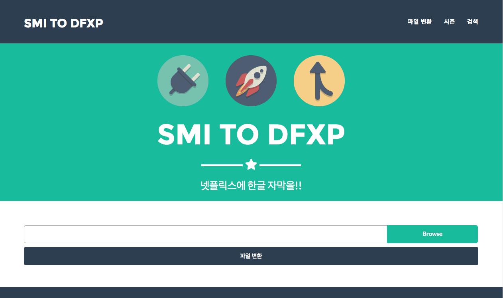
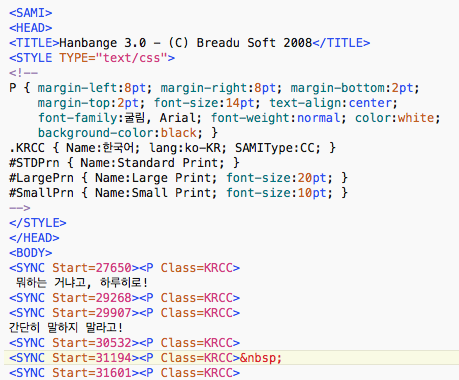

# SMI TO DFXP

**넷플릭스의 국내 진출(2017년)로 사이트 종료**

DFXP는 웹동영상 자막의 확장자입니다. 웹에서 구동되는 웹들은 기본적으로 *.dfxp 형태의 포멧의 자막을 지원합니다.

넷플릭스는 dfxp를 지원중이며 우리나라에서 가장 많이 사용하는 smi 파일을 dfxp 파일로 변환하기 위한 사이트 입니다.

---

- 자막파일 smi파일을 웹용 자막파일인 dfxp로 변환해 주는 사이트
- django를 이용한 웹서버 구축 및 smi파일 파싱을 통한 dfxp파일로 변환
- 모듈별 한글 인코딩에 따른 예외 처리 습득 및 향후 변환한 자막들을 시리즈물로 묶어서 배포할 예정

---

한글의 경우 다양한 파일 포멧으로 되어 있습니다. (UTF-8 / ISO-8859-2 / cp949 등) 파일을 작성한 프로그램 / OS에 따라 

한글 포멧이 달라지게 되는데 이를 모두 변환가능하도록 프로그램을 작성하였습니다.
